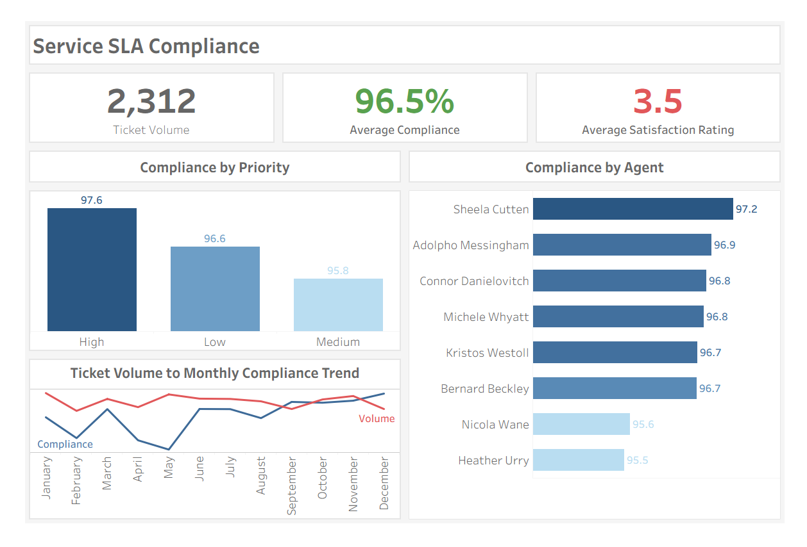

# MagnaTech Service Operations: SLA Performance Analysis

## Executive Summary

MagnaTech maintains strong SLA compliance (96.5%) across 2,312 service tickets, with consistent performance across agents, indicating well-standardized operations.

However, two key risks emerge:
- Performance dips during high workload periods
- A gap between SLA compliance and customer satisfaction (3.5/5)

This suggests that while operations are efficient, they are sensitive to demand fluctuations and not fully optimised for service quality.

## Business Context

MagnaTech operates a centralised support desk governed by SLA targets for response and resolution times. As ticket volume grows, leadership requires visibility into:
- Performance consistency
- Workload impact
- Alignment between operational efficiency and customer experience

## Analytical Focus

This analysis evaluates:
- SLA consistency across agents
- Performance difference by ticket priority
- Impact of ticket volume on compliance
- Relationship between SLA performance and customer satisfaction

## Data & Tools
- Datasets: 2,312 service tickets
- Tools: MySQL (data analysis), Tableau (dashboard)

[*View core sql queries*](sql/magnatech_sla_analysis.md)

## Key Insights 

#### Stakeholder Dashboard

### Consistent Operational Performance
  - SLA range: 95.5% - 97.2%

Strong consistency indicates effective process standardization rather than reliance on individual performance.

### Priority Influences Efficiency
  - High: 97.6%
  - Low: 96.6%
  - Medium: 95.8%

High-priority tickets are handled most effectively, while medium-priority tickets show slight inefficiencies.

### Workload Impacts Stability
  - Compliance dips below 95% during high-volume months
  - Lowest: 94.1% (May)

Operational performance is sensitive to workload spikes, revealing limited resilience under pressure.

### Mid Customer Satisfaction
  - SLA at 96.5% while satisfaction at 3.5/5

Meeting SLA targets does not fully translate to improved customer experience.

## Recommendations
- Balance workload distribution to maintain performance during peak periods
- Refine priority handling, especially for medium-priority tickets
- Expand performance metrics beyond SLA (e.g., resolution quality, customer feedback)
- Track trends over time to identify recurring patterns

## Limitations
- Simulated dataset may not reflect full operational complexity
- Single-period analysis limits long-term insights
